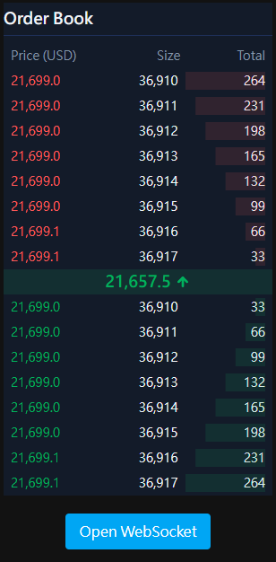

# Order Book

## 專案描述

這是一個訂單簿應用程式，使用 WebSocket 來接收訂單簿和最新價格的資料，並顯示在頁面上。

## 使用的前端技術

- Vite
- React
- TypeScript
- Tailwind CSS
- WebSocket
- Vitest

## 安裝與啟動

- Node.js 版本需求：18+
- 本專案使用 [pnpm](https://pnpm.io/zh-TW) 建立。

1. Clone 專案：
   ```
   git clone git@github.com:BolasLien/order-book.git
   ```
2. 安裝相依套件：
   ```
   pnpm install
   ```
3. 啟動開發模式：
   ```
   pnpm dev
   ```

## 說明



- 啟動服務，預設頁面是 http://localhost:5173/
- 進入頁面後，點擊 **Open WebSocket 按鈕**連接 WebSocket 服務。
- 頁面上會顯示最新價格，以及買賣的 orderbook。
- 買賣的 orderbook 最多顯示 8 筆。
- 買賣的 orderbook 會以千分位逗號分隔數字。
- 最新價格在中間的位置，文字顏色會根據前一次的價格變化而變色。
- 當滑鼠移到 orderbook 上時，整列會變色。
- 當有新的價格出現時，會有背景提示高亮效果。
- 當數量有變化時，會有背景提示高亮效果。
- 買賣的 orderbook 會顯示累積總數的百分比的背景色。

## 單元測試

針對「千分位逗號分隔數字」的功能，有撰寫測試程式來保護輸入輸出的邏輯。

- 執行測試：
  ```
  pnpm test
  ```
- 測試程式碼在 `src/utils/formatNumber.test.ts`。